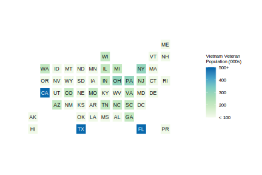

```{r setup, include=FALSE}
knitr::opts_chunk$set(echo = FALSE)

library(survey)

#Data - Vietnam Era  Veterans Survey Design Object
viet11_design <- readRDS("Data_per11_viet_design.Rds")
viet16_design <- readRDS("Data_per16_viet_design.Rds")


#total vietnam veterans (VPS ==  6 or 7 or 8)
viet.vets.2011 <- sum(svytable(~VPS, viet11_design))
viet.vets.2016 <- sum(svytable(~VPS, viet16_design))
#change in Viet VET population from 2011 to 2016
viet.vets.diff <- (viet.vets.2016 - viet.vets.2011)/viet.vets.2011
viet.vets.diff <- round(viet.vets.diff *100, digits = 1)

#2016 viet vets by SEX
sex <- svytotal(~factor(SEX), viet16_design)

```

## About

This page lists several statistics on Vietnam Veterans from the [1- year 2016 American Community Survey (ACS) Public Use Microdata Sample (PUMS) Person file.](https://www.census.gov/programs-surveys/acs/data/pums.html) The ACS person file covers 50 states, District of Columbia and Puerto Rico. My intent is to build out the page by adding more ACS variables gradually. [All the code and data are avaialble on GitHub.](https://github.com/mihiriyer/vietvet-acsstats-2016) You may find it useful to check out the [ACS PUMS technical documentation from US Census Bureau's website.](https://www.census.gov/programs-surveys/acs/technical-documentation/code-lists.2016.html)


## Population 

**Vietnam Veterans:** `r format(sum(viet.vets.2016), big.mark = ",")` (Male `r format(sex[1], big.mark = ",")` / Female `r format(sex[2], big.mark = ",")` )  

## Population Change (since 2011)

`r viet.vets.diff`% (`r format(viet.vets.2016 - viet.vets.2011, big.mark = ",")`)

## Population by State 




## Age Group

```{r age_struc}
#Create categorical version of AGEP
age.range <- seq(55, 105, 10)
viet16_design <- update(viet16_design, AGEP.Cat = cut(AGEP, age.range, right = FALSE))
agecat <- svymean(~AGEP.Cat, viet16_design, na.rm = TRUE) * 100
agecat <- round(agecat, digits = 2)

#male total by age group
agecat.m <- svytotal(~factor(AGEP.Cat), subset(viet16_design, SEX == 1))

#FEMALE total by age group
agecat.f <- svytotal(~factor(AGEP.Cat), subset(viet16_design, SEX == 2))

```

**55 - 64 years:**  `r agecat[1]`%  (Male `r format(agecat.m[1], big.mark = ",")` / Female `r format(agecat.f[1], big.mark = ",")`)  
**65 - 74 years:**  `r agecat[2]`%  (Male `r format(agecat.m[2], big.mark = ",")` / Female `r format(agecat.f[2], big.mark = ",")`)  
**75 - 84 years:**  `r agecat[3]`%  (Male `r format(agecat.m[3], big.mark = ",")` / Female `r format(agecat.f[3], big.mark = ",")`)  
**85 - 94 years:**  `r agecat[4]`%  (Male `r format(agecat.m[4], big.mark = ",")` / Female `r format(agecat.f[4], big.mark = ",")`)  
**95 - 104 years:** `r agecat[5]`%  (Male `r format(agecat.m[5], big.mark = ",")` / Female `r format(agecat.f[5], big.mark = ",")`)  

## Median Age

```{r age_median}
#Median Age of Vietnam Veterans
age.median <- svyquantile(~AGEP, viet16_design, quantiles = c(0.5))
age.median.m <- svyquantile(~AGEP, subset(viet16_design, SEX == 1), quantiles = c(0.5))
age.median.f <- svyquantile(~AGEP, subset(viet16_design, SEX == 2), quantiles = c(0.5))

```

**Total:** `r age.median` years  (Male `r age.median.m` / Female `r age.median.f`)

## Race (Non-Hispanic)

```{r race}
#create new race variable RaceNH to serve as a rolled-up version of RAC1P
viet16_design <- update(viet16_design, RaceNH = character(nrow(viet16_design)))
#roll-up RaceNH levels
viet16_design <- update(viet16_design,
                        RaceNH = ifelse(RAC1P %in% c(3:5), "AIAN", 
                                        ifelse(RAC1P %in% c(6:7), "Asian/NHOPI",
                                               ifelse(RAC1P == 2, "Black", 
                                                      ifelse(RAC1P == 1, "White", "Other")))
                        )
                        
)

racenh <- svymean(~factor(RaceNH), subset(viet16_design, HISP == 1)) * 100
racenh <- round(racenh, digits = 1)

```

American Indian/Alaska Native `r racenh[1]`%  
Asian/NHOPI `r racenh[2]`%  
Black `r racenh[3]`%  
Other `r racenh[4]`%  
White `r racenh[5]`%  

## Ability to Speak English

```{r engspk}

engspk <- svymean(~factor(ENG), viet16_design, na.rm = TRUE) * 100
engspk <- round(engspk, digits =1)

```

Very well `r engspk[1]`%  
Well `r engspk[2]`%    
Not well `r engspk[3]`%    
Not at all `r engspk[4]`%  

## Citizenship Status

```{r cit}

cit <- svymean(~factor(CIT), viet16_design, na.rm = TRUE) * 100
cit <- round(cit, digits = 1)

```

Born in the U.S. `r cit[1]`%   
Born in Puerto Rico, Guam, U.S. Virgin Islands, or Northern Marianas `r cit[2]`%    
Born abroad of American parent(s) `r cit[3]`%   
U.S. citizen by naturalization `r cit[4]`%   
Not a citizen of the U.S. `r cit[5]`%   

## Marital Status 

```{r mar}

mar<- svymean(~factor(MAR), viet16_design, na.rm = TRUE) * 100
mar <- round(mar, digits = 1)

```

Divorced `r mar[3]`%  
Married `r mar[1]`%  
Never Married `r mar[5]`%  
Separated `r mar[4]`%  
Widowed `r mar[2]`%   

## Number of Times Married
```{r marht}

marht<- svymean(~factor(MARHT), viet16_design, na.rm = TRUE) * 100
marht <- round(marht, digits = 1)

```

One time `r marht[1]`%  
Two times `r marht[2]`%  
Three or more times `r marht[3]`%  

## Married (in the past 12 months)
```{r marhm}
marhm<- svymean(~factor(MARHM), viet16_design, na.rm = TRUE) * 100
marhm <- round(marhm, digits = 1)

```
Yes `r marhm[1]`%     
No `r marhm[2]`%    

## Divorced (in the past 12 months)

```{r marhd}
marhd<- svymean(~factor(MARHD), viet16_design, na.rm = TRUE) * 100
marhd <- round(marhd, digits = 1)

```

Yes `r marhd[1]`%     
No `r marhd[2]`%    

## Widowed (in the past 12 months)

```{r marhw}
marhw<- svymean(~factor(MARHW), viet16_design, na.rm = TRUE) * 100
marhw <- round(marhw, digits = 1)

```

Yes `r marhw[1]`%     
No `r marhw[2]`%    

## Grandparents Living with Grandchildren

```{r gcl}

gcl <- svymean(~factor(GCL), viet16_design, na.rm = TRUE) * 100
gcl <- round(gcl, digits = 1)

```

Grandparents live with grandchildren `r gcl[1]`%  
Grandparents DO NOT live with grandchildren `r gcl[2]`%  

## Grandparents Responsible for Grandchildren

```{r gcr}
gcr <- svymean(~factor(GCR), viet16_design, na.rm = TRUE) * 100
gcr <- round(gcr, digits = 1)
```

Grandparents responsible for grandchildren `r gcr[1]`%  
Grandparents NOT responsible for grandchildren `r gcr[2]`%  

## Length of Time Responsible for Grandchildren

```{r gcm}

gcm <- svymean(~factor(GCM), viet16_design, na.rm = TRUE) * 100
gcm <-  round(gcm, digits = 1)

```

Less than 6 months `r gcm[1]`%    
6 to 11 months `r gcm[2]`%  
1 or 2 years `r gcm[3]`%  
3 or 4 years `r gcm[4]`%  
5 or more years `r gcm[5]`%  


## Educational Attainment

```{r edu}
#convert SCHL variable to factor and condense levels
viet16_design$variables$SCHL <- factor(viet16_design$variables$SCHL)
levels(viet16_design$variables$SCHL) <-  list(LHS = c(1:15), HS = c(16:17), SC = c(18:20), BAC = 21, ADV = c(22:24))

schl <- svymean(~SCHL, viet16_design, na.rm = TRUE) * 100
schl <- round(schl, digits = 1)

```

Less than High School `r schl[1]`%  
High School Graduate `r schl[2]`%  
Some College `r schl[3]`%  
Bachelor's Degree `r schl[4]`%  
Advanced Degree `r schl[4]`%  

## Employment Status

```{r esr}

esr <- svymean(~factor(ESR), viet16_design, na.rm = TRUE) * 100
esr <- round(esr, digits = 1)

```

Not in Labor Force `r esr[4]`%  
Unemployed `r esr[3]`%  
At Work (Civilian Employed) `r esr[1]`%  
With Job NOT at Work (Civilian Employed) `r esr[2]`%  

## Class of Worker

```{r cow}

viet16_design$variables$COW <- factor(viet16_design$variables$COW)
levels(viet16_design$variables$COW) <- list(Pvt = c(1,2,8), Govt = c(3:5), SelfEmp = c(6,7), Unemp = 9)
cow <- svymean(~COW, subset(viet16_design, COW != "Unemp"), na.rm = TRUE) * 100
cow <- round(cow, digits = 1)

```

Private sector `r cow[1]`%  
Public sector `r cow[2]`%  
Self-employed `r cow[3]`%    

## Personal Income

```{r pincp}
#vector of income ranges used to convert numeric income variable into categorical variable.
income.range <- c(seq(0, 100000, 20000), Inf)

viet16_design <- update(viet16_design, PINCP.Cat = cut(PINCP, income.range, right = FALSE))
pincp <- svymean(~PINCP.Cat, viet16_design, na.rm = TRUE) * 100
pincp <- round(pincp, digits = 1)


```

**$0 - $19,999:** `r pincp[1]`%  
**$20,000 - $39,999:** `r pincp[2]`%  
**$40,000 - $59,999:** `r pincp[3]`%  
**$60,000 - $79,999:** `r pincp[4]`%  
**$80,000 - $99,999:** `r pincp[5]`%  
**$100,000+ :** `r pincp[6]`%  


## Personal Earnings

```{r pernp, echo = FALSE}

viet16_design <- update(viet16_design, PERNP.Cat = cut(PERNP, income.range, right = FALSE))
pernp <- svymean(~PERNP.Cat, viet16_design, na.rm = TRUE) * 100
pernp <- round(pernp, digits = 1)

```

**$0 - $19,999:** `r pernp[1]`%  
**$20,000 - $39,999:** `r pernp[2]`%  
**$40,000 - $59,999:** `r pernp[3]`%  
**$60,000 - $79,999:** `r pernp[4]`%  
**$80,000 - $99,999:** `r pernp[5]`%  
**$100,000+ :** `r pernp[6]`%  

## Social Security Income

```{r ssp, echo = FALSE}
viet16_design <- update(viet16_design, SSP.Cat = cut(SSP, income.range, right = FALSE))
ssp <- svymean(~SSP.Cat, viet16_design, na.rm = TRUE) * 100
ssp <- round(ssp, digits = 1)

```

**$0 - $19,999:** `r ssp[1]`%  
**$20,000 - $39,999:** `r ssp[2]`%  
**$40,000 - $59,999:** `r ssp[3]`%  
**$60,000 - $79,999:** `r ssp[4]`%  
**$80,000 - $99,999:** `r ssp[5]`%  
**$100,000+ :** `r ssp[6]`%  

## Retirement Income

```{r retp, echo = FALSE}
viet16_design <- update(viet16_design, RETP.Cat = cut(RETP, income.range, right = FALSE))
retp <- svymean(~RETP.Cat, viet16_design, na.rm = TRUE) * 100
retp <- round(retp, digits = 1)

```

**$0 - $19,999:** `r retp[1]`%  
**$20,000 - $39,999:** `r retp[2]`%  
**$40,000 - $59,999:** `r retp[3]`%  
**$60,000 - $79,999:** `r retp[4]`%  
**$80,000 - $99,999:** `r retp[5]`%  
**$100,000+ :** `r retp[6]`% 

## Disability Status 
```{r drat_dratx}
#disability status
dis <- svymean(~factor(DIS), viet16_design, na.rm = TRUE) * 100
dis <- round(dis, digits = 1)
#scd status
dratx <- svymean(~factor(DRATX), viet16_design, na.rm = TRUE) * 100
dratx <- round(dratx, digits = 1)
#scd rating
drat <- svymean(~factor(DRAT), viet16_design, na.rm = TRUE) * 100
drat <- round(drat, digits = 1)

```

With a disability `r dis[1]`%  
Without a disability `r dis[2]`%  

## Service Connected Disability

Has SCD rating `r dratx[1]`%  
Does NOT have SCD rating `r dratx[2]`%  

## Service Connected Disability Rating 

**0%:** `r drat[1]`%  
**10 - 20%:** `r drat[2]`%  
**30 - 40%:** `r drat[3]`%  
**50 - 60%:** `r drat[4]`%  
**70 < %:** `r drat[5]`%  
**Not Reported:** `r drat[6]`%  

## Self-care Difficulty
```{r disabilities}

#self-care difficulty
ddrs <- svymean(~factor(DDRS), viet16_design, na.rm = TRUE) * 100
ddrs <- round(ddrs, digits = 1)

#hearing difficulty
dear<- svymean(~factor(DEAR), viet16_design, na.rm = TRUE) * 100
dear <- round(dear, digits = 1)

#vision difficulty
deye <- svymean(~factor(DEYE), viet16_design, na.rm = TRUE) * 100
deye <- round(deye, digits = 1)

#independent living difficulty
dout <- svymean(~factor(DOUT), viet16_design, na.rm = TRUE) * 100
dout <- round(dout, digits = 1)

#ambulatory difficulty
dphy <- svymean(~factor(DPHY), viet16_design, na.rm = TRUE) * 100
dphy <- round(dphy, digits = 1)

#cognitive difficulty
drem <- svymean(~factor(DREM), viet16_design, na.rm = TRUE) * 100
drem <- round(drem, digits = 1)

```

Has difficulty dressing or bathing `r ddrs[1]`%  
Does NOT have difficulty dressing or bathing `r ddrs[2]`%  

## Hearing Difficulty

Is deaf or has serious difficulty hearing `r dear[1]`%  
Is NOT deaf or does NOT have serious difficulty `r dear[2]`%  

## Vision Difficulty

Is blind or has serious difficulty seeing (even when wearing glasses) `r deye[1]`%  
Is NOT blind or does NOT have difficulty seeing  `r deye[2]`%  

## Independent Living Difficulty

Has difficulty doing errands alone (e.g. visiting doctor's office, shopping, etc.) `r dout[1]`%  
Does NOT have difficulty doing errands `r dout[2]`%  

## Ambulatory Difficulty

Has serious difficulty walking or climbing stairs `r dphy[1]`%  
Does NOT have difficulty walking or climbing stairs `r dphy[2]`%  

## Cognitive Difficulty

Has difficulty concentrating, remembering or making decisions `r drem[1]`%  
Does NOT have difficulty concentrating, remembering or making decisions `r drem[2]`%  

## Health Insurance Coverage (Overall)

```{r hicov}
hicov <- svymean(~factor(HICOV), viet16_design, na.rm = TRUE) * 100
hicov <- round(hicov, digits = 1)

```

Covered `r hicov[1]`%   
Not Covered `r hicov[2]`%   

## Health Insurance Coverage (Public vs. Private)

```{r pubprivcov}

#public coverage
pubcov <- svymean(~factor(PUBCOV), viet16_design, na.rm = TRUE) * 100
pubcov <- round(pubcov, digits = 1)

#private coverage
privcov <- svymean(~factor(PRIVCOV), viet16_design, na.rm = TRUE) * 100
privcov <- round(privcov, digits = 1)


```

**Public Health Insurance Coverage (Medicare, Medicaid and VA)**    
Covered `r pubcov[1]`%    
NOT Covered `r pubcov[2]`%    

**Private Health Insurance Coverage (Employer, Direct-Purchase and TRICARE/CHAMPUS)**  
Covered `r privcov[1]`%  
NOT Covered `r privcov[2]`%  

## Health Insurance Coverage (Specific Type)

```{r hins}

hins1 <- svymean(~factor(HINS1), viet16_design, na.rm = TRUE) * 100
hins1 <- round(hins1, digits = 1)

hins2 <- svymean(~factor(HINS2), viet16_design, na.rm = TRUE) * 100
hins2 <- round(hins2, digits = 1)

hins3 <- svymean(~factor(HINS3), viet16_design, na.rm = TRUE) * 100
hins3 <- round(hins3, digits = 1)

hins4 <- svymean(~factor(HINS4), viet16_design, na.rm = TRUE) * 100
hins4 <- round(hins4, digits = 1)

hins5 <- svymean(~factor(HINS5), viet16_design, na.rm = TRUE) * 100
hins5 <- round(hins5, digits = 1)

hins6 <- svymean(~factor(HINS6), viet16_design, na.rm = TRUE) * 100
hins6 <- round(hins6, digits = 1)

hins7 <- svymean(~factor(HINS7), viet16_design, na.rm = TRUE) * 100
hins7 <- round(hins7, digits = 1)

```

**Employer or Union Based**   
Covered `r hins1[1]`%    
NOT Covered `r hins1[2]`%  

**Direct purchase**   
Covered `r hins2[1]`%   
NOT Covered `r hins2[2]`%   

**Medicare (65 and older or certain disabilities)**  
Covered `r hins3[1]`%   
NOT Covered `r hins1[2]`%   

**Medicaid (Low income or disability)**    
Covered `r hins4[1]`%   
NOT Covered `r hins4[2]`%   

**TRICARE**  
Covered `r hins5[1]`%   
NOT Covered `r hins6[2]`%   

**VA Healthcare (Used or Enrolled)**  
Covered `r hins6[1]`%  
NOT Covered `r hins6[2]`%  

**Indian Health Services**  
Covered `r hins7[1]`%  
NOT Covered `r hins7[2]`%  
